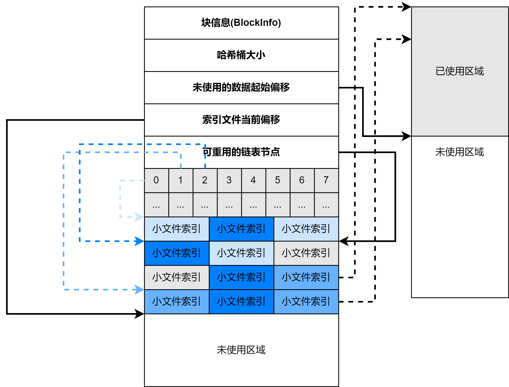
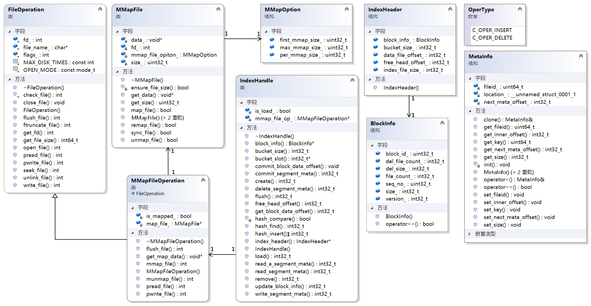

# 分布式文件系统存储引擎

## 设计思路

1. 以块文件的形式存放数据文件,每个块具有唯一的整数编号,块在使用之前所用到的存储空间需要预先分配和初始化.
2. 每个块有一个对应的索引文件,主块文件以及若干个扩展块,小文件存放在主块中.
3. 每个索引文件存放对应的块信息以及块中小文件的索引信息.索引文件会被映射到内存,以提高文件检索速度.小文件索引信息使用哈希链表组织在索引文件中.
4. 每个小文件对应一个唯一编号,编号从1开始,依次递增,文件编号作为哈希查找时的key来定位小文件在主块文件和扩展块中的偏移量.

## 文件存储文件结构

## 类设计

